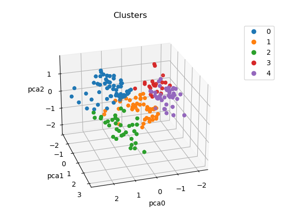
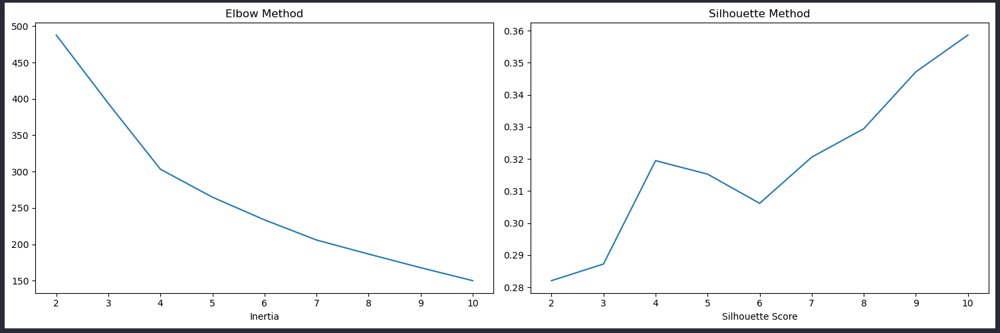
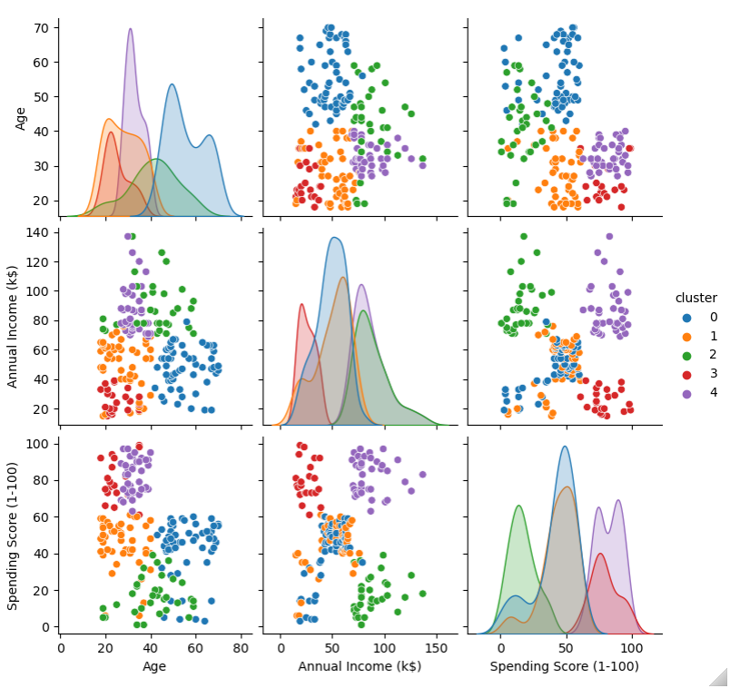
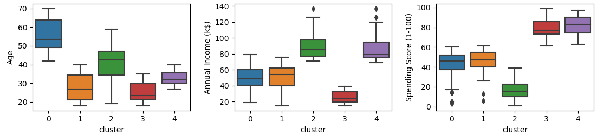

[](https://www.linkedin.com/in/pedro-bull-0363ba1a1/)
[](https://www.python.org/)

# Clusterização de Clientes cadastrados em Supermercado

Um supermercado, através de cartões de fidelidade, possui alguns dados básicos sobre seus clientes, como idade, gênero, renda anual e pontuação de gastos. Tal pontuação é algo que o supermercado atribui ao cliente com base em parâmetros definidos, como comportamento do cliente e dados de compra. Com o objetivo de melhoras as estratégias de negócios, este projeto visa criar um modelo de segmentação de clientes.



[Link original para o dataset](https://www.kaggle.com/vjchoudhary7/customer-segmentation-tutorial-in-python)

<p align="center"> 
  <a href="https://www.linkedin.com/in/pedro-bull-0363ba1a1/" target="_blank"></a> 
</p>

## Objetivos

O objetivo deste projeto é, a partir de uma base cadastral, construir um modelo capaz de segmentar os clientes em grupos com base em seus dados de compra. Em um cenário real, tal segmentação poderia ser utilizada pelo supermercado para entender melhor os perfis dos compradores e, assim, formular estratégias de marketing e negócios específicas para aproveitar o potencial de compra de cada grupo. 

Este projeto tem como objetivo aplicar técnicas de clusterização para segmentar clientes utilizando a base cadastral de clientes de um supermercado. Em um cenário real, a análise poderia ser utilizada para identificar padrões de comportamento e agrupar clientes com características semelhantes, fornecendo insights para estratégias de marketing direcionadas e personalização de ofertas. O projeto foi desenvolvido em Python, com a utilização de bibliotecas como Pandas, Scikit-learn e Matplotlib, para o pré-processamento, análise exploratória e visualização dos resultados.


## Estrutura do repositório

O repositório está estruturado da seguinte forma:

```
├── data
├── images
├── models
├── notebooks
├── reports
```

- Na pasta `data` estão os dados utilizados no projeto. A base de dados original é o arquivo `Mall_Customers.csv`, sendo que os demais datasets foram gerados durante o projeto e salvos na pasta para fins de organização e versionamento.
- Na pasta `images` estão as imagens utilizadas neste README.
- Na pasta `models` estão os modelos gerados durante o projeto. 
- Na pasta `notebooks` estão os notebooks com o desenvolvimento do projeto. Em detalhes, temos:
  - [`01_eda_smk_clientes`](notebooks/01_eda_smk_clientes.ipynb): notebook com a análise exploratória dos dados usando [ydata-profiling](https://github.com/ydataai/ydata-profiling) e Seaborn.
  - [`02_pipeline_smk.ipynb`](notebooks/02_pipeline_smk.ipynb): notebook com a clusterização dos dados usando K-Means, estruturado com pipelines do Scikit-Learn.
  - [`03_pipeline_smk_pca.ipynb`](notebooks/03_pipeline_smk_pca.ipynb): notebook com a clusterização dos dados usando K-Means, estruturado com pipelines do Scikit-Learn e com redução de dimensionalidade.
  - [`auxiliary_functions.py`](notebooks/funcoes_auxiliares.py): arquivo com funções auxiliares utilizadas nos notebooks.
- Na pasta `reports` estão os relatórios gerados durante o projeto utilizando a biblioteca [ydata-profiling](https://github.com/ydataai/ydata-profiling).

## Detalhes do dataset utilizado e resumo dos resultados

A base de dados [`Mall_Customers.csv`](dados/Mall_Customers.csv) contém os seguintes dados:

- `CustomerID`: ID do cliente
- `Gender`: sexo do cliente
- `Age`: idade do cliente
- `Annual Income (k$)`: renda anual do cliente
- `Spending Score (1-100)`: pontuação de gastos do cliente


Com o pipeline realizando pré-processamento e K-Means, a base foi segmentada em 5 clusters. Os gráficos de Elbow method e Silhouette method mostrados abaixo foram usados para definir o número de clusters, o qual se mostrou como a melhor opção considerando os gráficos e o número de personas criadas para o problema.



Em seguida, a correlação das variáveis foi avaliada em pares com o gráfico de pairplot, evidenciando cada um dos clusters conforme legenda. Para essa análise, o objetivo é entender, com os gráficos de dispersão, como cada par de variáveis se relaciona com a divisão dos clusters. Já os gráficos mostrados na diagonal principal da figura ilustram a distribuição dos dados para cada uma das variávies do problema, também evidenciando o comportamento de cada cluster conforme legenda.



Por fim, foram utilizados gráficos de boxplot para avaliar tanto a distribuição estatítica dos dados dentro de cada cluster como a existência de outliers. 



Após as análises, as personas para cada cluster foram definidas da seguinte forma:

- Cluster 0 - Idade alta, renda média, pontuação média 
- Cluster 1 - Idade baixa, renda média, pontuação média
- Cluster 2 - Idade média, renda alta, pontuação baixa
- Cluster 3 - Idade baixa, renda baixa, pontuação alta
- Cluster 4 - Idade média, renda alta, pontuação alta

Visualizando em formato de tabela:

| Idade    | Renda    | Pontuação  | Cluster |
| -------- | -------- | ---------- | ------- |
| Alta     | Média    | Média      | 0       |
| Baixa    | Média    | Média      | 1       |
| Média    | Alta     | Baixa      | 2       |
| Baixa    | Baixa    | Alta       | 3       |
| Média    | Alta     | Alta       | 4       |

A redução de dimensionalidade com o PCA(Principal Component Analysis) executada no terceiro dataset do repositório foi um experimento para avaliar qual seria o impacto dessa técnica no projeto. Em contextos reais, essa pode ser uma boa forma para apresentar resultados graficamente, uma vez que em problemas com mais de 3 dimensões fica difícil tangibilizar os resultados de maneira gráfica.

Para esse caso, a redução das 5 dimensões originais para 3 dimensões resultou em componentes que conseguem explicar somente 86,10% da variância dos dados. Com isso, como a base de dados é bastante enxuta, optou-se por manter a clusterização com as 5 dimensões geradas pela etapa de pré-processamento.

Por fim, o projeto entrega uma metodologia robusta e confiável para a segmentação de clientes em questão, que pode ser replicada em diversos cenários com os ajustes intrínsecos a natureza de cada aplicação.

## Como reproduzir o projeto

O projeto foi desenvolvido utilizando o Python 3.11.5. Para reproduzir o projeto, crie um ambiente virtual com o Conda, ou ferramenta similar, com o Python 3.11.5 e instale as bibliotecas abaixo:

| Biblioteca   | Versão |
| ------------ | ------ |
| Matplotlib   | 3.7.1  |
| NumPy        | 1.24.3 |
| Pandas       | 1.5.3  |
| Scikit-Learn | 1.3.0  |
| Seaborn      | 0.12.2 |

Essas são as bibliotecas principais utilizadas no projeto. O relatório foi gerado com a biblioteca [ydata-profiling](https://github.com/ydataai/ydata-profiling), instale-a se quiser reproduzir o relatório. Para ter um gráfico em 3 dimensões interativo, instale a biblioteca [ipympl](https://matplotlib.org/ipympl/).
